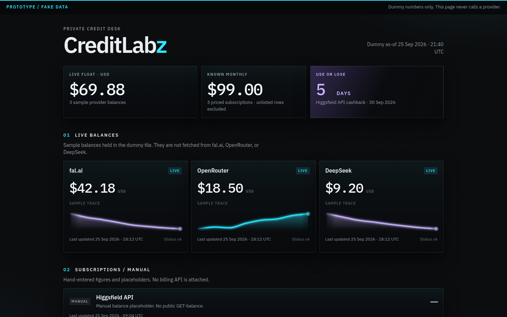

# CreditLabz — Ravyn Preview (v3)

> Ravyn's next bake-off pass for Jon's **CreditLabz** desk. Deep charcoal and
> cool gray, with red as the lead accent and gold only as a micro accent.

[](https://jonbeatz.github.io/creditlabz-ravyn-preview/)
[](https://github.com/jonbeatz/creditlabz-ravyn-preview/tree/preview/creditlabz-v3-next-pass)
[](https://github.com/jonbeatz/creditlabz-ravyn-preview/commits/preview/creditlabz-v3-next-pass)


**Published Pages:** https://jonbeatz.github.io/creditlabz-ravyn-preview/

GitHub Pages builds from **`preview/creditlabz-v3-next-pass`**, so that URL is
this desk, with the gray umbrella Z in the header. There is no pull request.
`main` still holds the earlier gold entry and is not modified by this pass.



> **Prototype data only.** Every balance, renewal date, usage bar, and
> connection is invented. No credentials are stored or sent from this page.

## What's inside

- **Live API balance cards** — fal.ai, OpenRouter, and DeepSeek. Each card
  draws mini usage bars (slate for earlier days, glowing red for the latest)
  and a sample delta versus the 12-day average: fal.ai ▲$2.40, OpenRouter
  ▲$0.95, DeepSeek ▲$1.80.
- **7-day usage panel** — the same sample window, last seven days combined.
- **Manual accounts** — Higgsfield API, Higgsfield Starter ($19/mo), Cursor
  ($60/mo, renews October 11, 2026), Codex ($20/mo), Muse (Trinity) (Power
  plan, 36% used, 315M tokens left, resets September 28, 2026), and GrokBot
  (Ravyn).
- **GrokBot (Ravyn)** — a manual account. Weekly usage 3%, resets October 2,
  2026. On-demand $8.09 / $2, shown over limit in red, resets October 11,
  2026. She appears in Connections, the configure dialog, the manual list,
  and the sanitized export. Cyan is only her monogram.
- **Configured connections** — 0/9. None of the sample slots are authenticated.
- **Higgsfield cashback** — use or lose, closes September 30, 2026. The desk
  prints that calendar date. It does not count down in days.
- **Desk shell** — sticky Overview / Connections / Build plan tabs, a
  four-metric strip, monograms, a configure/edit dialog, an access-model
  panel, and one global DEMO banner.
- **Dummy ledger** — `data/balances.json` drives the page. `prototype` stays
  `true`. Export setup downloads a sanitized JSON file with no credential
  fields.

## Design language

Deep charcoal field, cool gray grid, flat panels. Corners are 4px. No colored
side strokes and no glass wash. **Red** leads: the latest usage bar, over-limit
amounts, use-or-lose, and the configure button. **Gold** is micro only — a tick
in the wordmark, a slit in the mark, and the ledger filename. Cyan is reserved
for the GrokBot (Ravyn) monogram.

**Manrope** carries the UI. **IBM Plex Mono** carries figures, eyebrows, and
labels.

## Tech stack

| Layer   | Choice                                                                 |
| ------- | ---------------------------------------------------------------------- |
| Markup  | Static `index.html` + `css/` + `js/`                                  |
| Data    | `data/balances.json` (dummy only, clearly labeled)                    |
| Type    | Manrope + IBM Plex Mono                                                |
| Runtime | None — a local static server or GitHub Pages                           |
| Hosting | GitHub Pages (`.nojekyll`) from `preview/creditlabz-v3-next-pass` |

## Project structure

```text
creditlabz-ravyn-preview/
├── index.html
├── css/styles.css
├── js/app.js
├── data/balances.json
├── assets/
│   ├── logo.png
│   └── screenshot.png
├── .nojekyll
└── README.md
```

## Open locally

```bash
python3 -m http.server 4173
```

Visit http://127.0.0.1:4173/ — a local server is required so the JSON ledger loads.

## Workflow

This file is the v3 branch. It does not merge to `main`. No pull request unless
Jon asks. Any UI change on this branch also replaces `assets/screenshot.png`
in the same commit, so the README hero matches the current dark desk.
